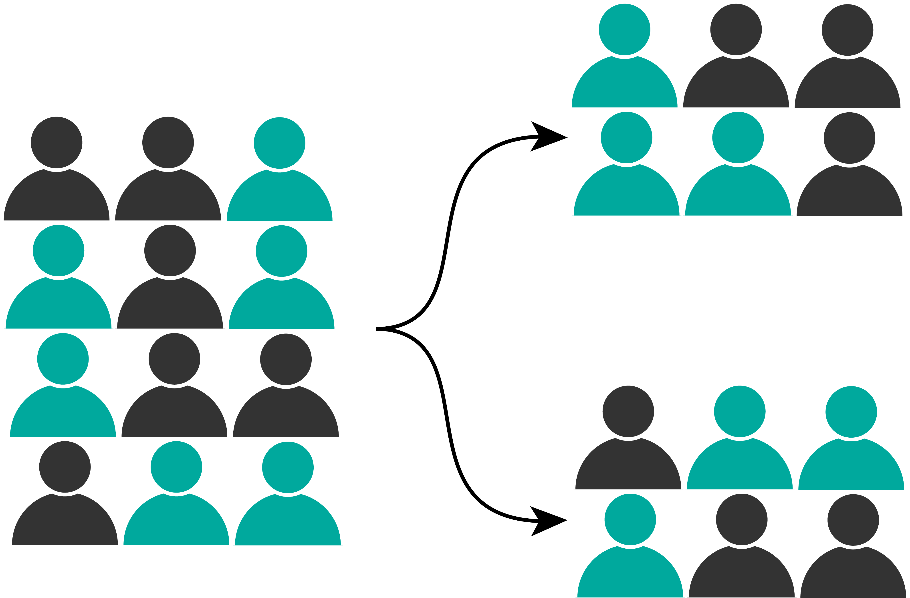
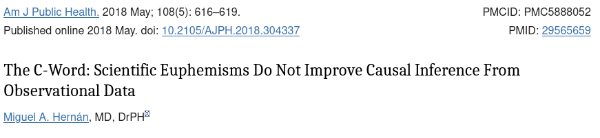
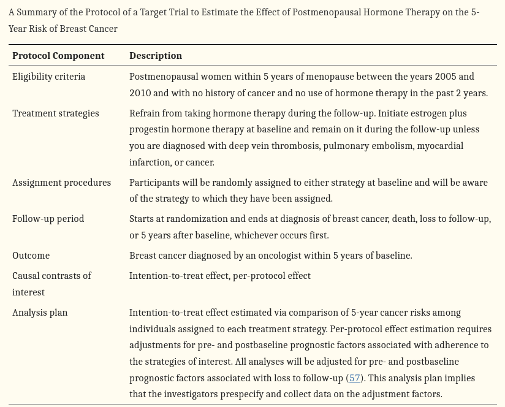

<section id="title-slide" data-background-image="./assets/Building_Dusk_Background.jpg" data-background-opacity="0.2" data-state="title">
  <h1> Interpreting Evidence from Real World Data </h1>
  
Presented by Chris Oldmeadow

  
Date: July 2024

</section>

## Presentation Overview

- The RCT

- Problems with RCT

- Observational data and the 'C-Word'

- Causal modeling with observational data

- The target trial

- Real World Examples

## The RCT {data-background-image="./assets/library.webp" data-background-opacity="0.2"}

 

## Problems with the RCT

- Expensive 
- Long duration
- Not always possible
- External valididity
    
    Real-world evidence uses data from patients receiving routine clinical care outside of trial settings, offering a chance to identify and address gaps in clinical trial evidence.
    
## RCTs also have potential problems with internal valididity

- blinding
- subjective outcomes
- missing data
- intercurrent events

    
## "Real world data"

* EMR
- Administrative datasets 
- Cancer registries
    
## Observational data and the "C-word"

"Dear author: Your observational study cannot prove causation. Please replace all references to causal effects by references to associations."

- Confounding means association does not imply causation. 
- Avoiding causal language in observational studies doesn't resolve this issue.
- Without clear causal language, the purposes and outcomes of much observational research become indistinguishably mixed.
- Associational questions are easy to formulate and straightforward to answer
- Causal questions, on the other hand, are not always easy to formulate.

## The Target Trial

 If we want to estimate the causal effect of a specific chemotherapy regimen on breast cancer outcomes, we first need to clarify what we mean by "the causal effect of this chemotherapy regimen on breast cancer outcomes." A useful approach is to define the causal effect in our population as the effect that would have been observed in a hypothetical trial where individuals were randomly assigned to either receive this chemotherapy regimen or an alternative treatment for a certain period
 
 a causal analysis in observational data can be viewed as an attempt to emulate a hypothetical trial—the target trial
 
 A key advantage of specifying the target trial is that it forces investigators to consider the intervention of interest and the time period during which it takes place. 
 
 key advantage of specifying the target trial is that it forces investigators to consider the intervention of interest and the time period during which it takes place. 
 
## Example in Breast Cancer
 

 
## Minimising the effect of confounders

- if the goal is associational analysis - no adjustment for confounders is needed
- if goal is causal then confounder adjustment is necessary
- DAGs are useful tool for considering confounders
- "Draw your assumptions before your conclusions"
- forces the research team to carefully think through the confounding variables and their interrelationships

## Propensity scores

- Probability of receiving a treatment conditional on confounders
- can use a logistic regression model to get a probability for each person
- "Given two people with the same probability of receiving treatment, but one person actually received treatment - what is the difference in their outcomes"
- Matching
- Weighting (IPTW)
 
 
 - allows assessment of how well you have achieved balance
 - does not specify an outcome model so is robust to this
 - not robust to the model for the treatment
 - there are doubly robust methods (one of the models can be misspecified)

## IPTW

Goal: estimate the relationship between treatment and outcome in a population where the treated and untreated are "exchangeable"

- Intuitively this can be done by creating a pseudo-population, where everybody is both treated and untreated (this breaks the link between treatment and confounding as everybody gets both)
- 

## Propensity matching

- create a "matched population" where the treated and untreated are exchangeable
- eg for every treated person, find an untreated person that was similar in every other way bit was not treated
- Propensity scores allow is to determine similarity
- Propensity score is prob of treatment
- For each treated individual find a untreated individual with a similar propensity score

## What about un-measured confounders

- Should perform a sensitivity analysis
- How robust are the results/conclusions to possible important un-measured confounders
- The E-value - How big a relative risk (between exposure and confounder) would need be to nullify an effect
- If bigger than any of the measured ones then that means unlikely
- If small then casts doubt on the results

<!-- To convert this markdown file into a HTML presentation, you would use the command pandoc -s -t revealjs  -V revealjs-url=https://unpkg.com/reveal.js/ -o presentation.html mypresentation.md. This tells pandoc to create a standalone (-s) reveal.js presentation (-t revealjs) with the output filename of presentation.html from the input file mypresentation.md.

You can also add other options like -V revealjs-url=path/to/reveal.js if reveal.js is not in the default path and other reveal.js specific options in the YAML front matter to customize the presentation. -->
